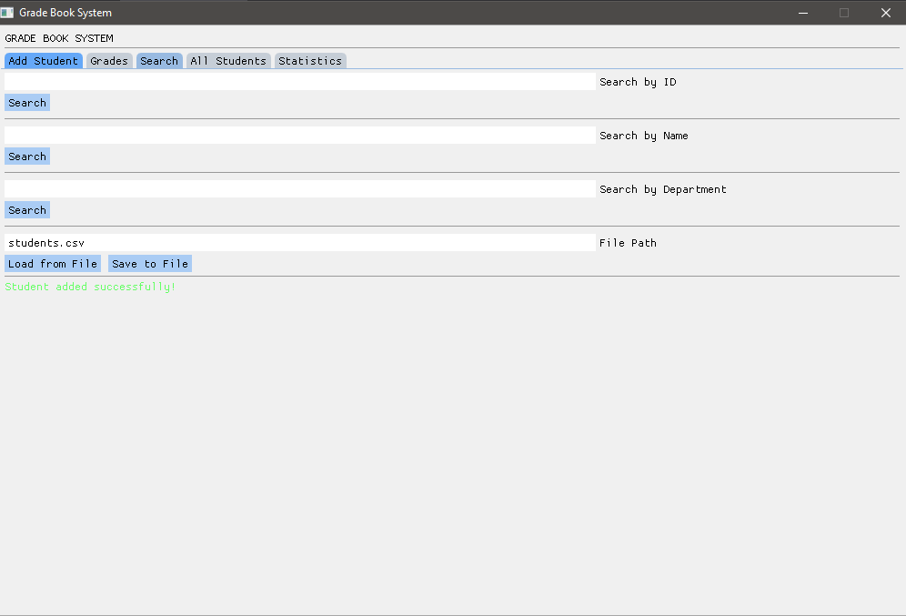
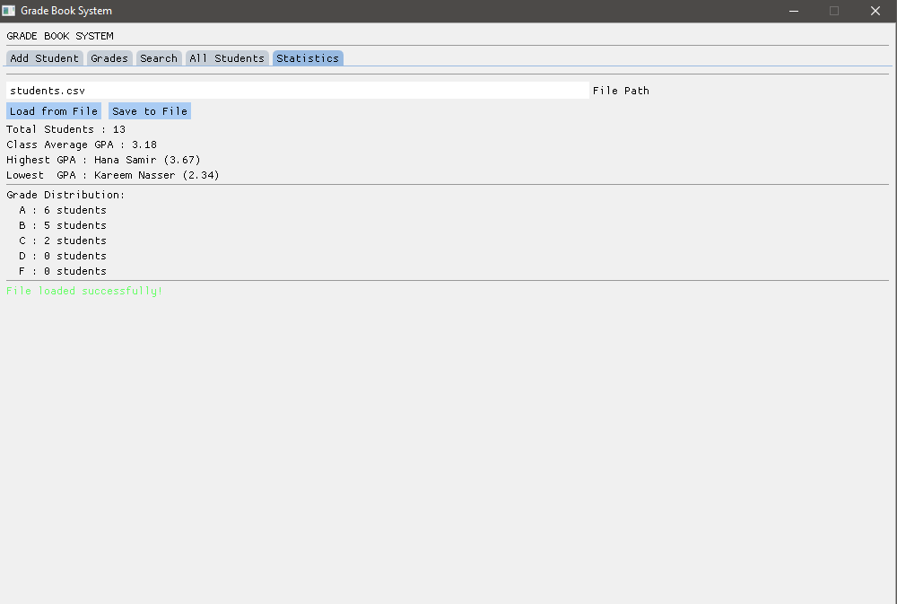

# Student Grade Checker
CSE333 – Data Structures and Algorithms | Spring 2026

---

## Group Members

| Ahmed Ashraf Ahmed | [2300161] |
| Abdelrahman Khaled Aboellel | [2300818] |
| Basil Sherif Talaat | [2300045] |
| Abdullah Hesham Nasr | [2300718] |
| Yahia Yasser Fathy| [2301185] |

---

## What is this project?

A C++ program that lets you manage student grades. You can add students, add their subject grades, search for them, see statistics about the whole class, and save/load everything from a file. It also has a GUI made with ImGui and SDL2.

---

## Data Structures We Used

**unordered_map** — we used this to store all students. The key is the student ID and the value is the student data. We chose it because searching by ID is O(1) which is much faster than looping through everything.

**map (BST)** — we used this inside GradeManager to keep students sorted by GPA. Since map is a balanced BST it stays sorted automatically, so we don't have to sort every time we want to display by GPA.

**vector** — used inside each student to hold their subjects. Simple and works well since we're just adding subjects one by one.

---

## Features

1. Add a new student (ID, name, department)
2. Add a grade for a subject
3. Update an existing grade
4. Remove a subject
5. Search by student ID
6. Search by name
7. Search by department
8. Display all students sorted by GPA, name, or ID
9. Show class statistics (average, highest, lowest, grade bands)
10. Delete a student
11. Save all data to a CSV file
12. Load data from a CSV file
13. Full GUI with tabs and a status bar

---

## Screenshots

### Add Student


### Search


### All Students


### Statistics


---

## How to Run

Make sure `SDL2.dll` and `students.csv` are in the same folder as the `.exe` then just run:

```
./GradeBook.exe
```

To load the student data, click "Load from File" when the program opens.

To compile from scratch:

```bash
g++ mainGUI.cpp gradeBook.cpp gradeManager.cpp statistics.cpp display.cpp student.cpp subject.cpp imgui/imgui.cpp imgui/imgui_draw.cpp imgui/imgui_tables.cpp imgui/imgui_widgets.cpp imgui/imgui_impl_sdl2.cpp imgui/imgui_impl_sdlrenderer2.cpp -Iimgui -ISDL2/include -LSDL2/lib -lSDL2main -lSDL2 -o GradeBook.exe
```

---

## AI Usage Declaration

We used Claude (claude.ai) during this project.

We used it for brainstorming at the start — figuring out how to split the work and deciding between different data structures. We also asked it syntax questions while coding like how map iteration works and what string::npos means, and used it to understand some compiler errors.

For the GUI specifically, we weren't familiar with ImGui and SDL2 so we asked Claude to explain how the libraries work — things like how the render loop is structured, how to set up tabs with BeginTabBar, and how InputText and BeginTable work. We used that understanding to write the GUI code ourselves.

One example where it wasn't helpful — when we asked about GPA calculation it gave us the raw percentage average instead of converting to a 4.0 scale, so we had to figure out the correct formula ourselves.

The core of the project — the class design, data structures, GPA index sync logic, and file parsing — was fully written and understood by us.
